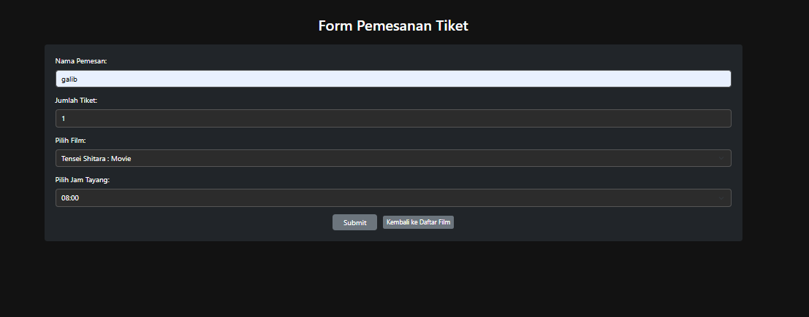
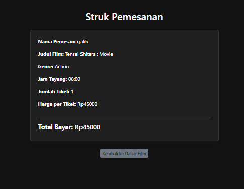

# 🎬 Sistem Pemesanan Tiket Bioskop (UTS Java JSP)

Proyek ini merupakan aplikasi web sederhana yang dikembangkan menggunakan **Java JSP (Java Server Pages)** *tanpa database* sebagai bagian dari Ujian Tengah Semester (UTS) mata kuliah **Pemrograman Java Lanjut**.

Aplikasi ini mensimulasikan proses pemesanan tiket bioskop secara online, di mana pengguna dapat melihat daftar film anime, memilih film dan jam tayang, serta memesan tiket dan mencetak struk pemesanan.

---

## ✨ Fitur Utama

- Menampilkan daftar film anime dalam bentuk kartu (card) menggunakan **Bootstrap 5 dark theme**.
- Formulir pemesanan tiket lengkap dengan input nama, jumlah tiket, pilihan film, dan jam tayang.
- Halaman struk yang menampilkan ringkasan data pemesanan pengguna.
- Antarmuka gelap (**dark mode**) yang elegan dan responsif.
- **Tanpa database** – data daftar film disimpan sementara menggunakan `session` di JSP.

---

## 📸 Screenshot Hasil Output

**Halaman Daftar Film:**  

**Form Pemesanan:**  

**Struk Pemesanan:**  

> Pastikan file gambar diletakkan di folder: `Web Pages/images/`

---

## 🛠 Instruksi Menjalankan Aplikasi

1. Aktifkan **XAMPP** (Apache + Tomcat).
2. Buka proyek menggunakan **NetBeans**.
3. Jalankan file `index.jsp`.
4. Aplikasi akan berjalan di browser dan menampilkan halaman utama bioskop.
5. Coba fitur:
   - Melihat daftar film anime.
   - Memesan tiket melalui form.
   - Melihat struk hasil pemesanan.

